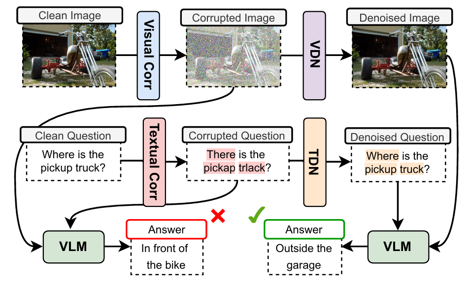

<div align="center">

# Enhancing Vision Language Corruption Robustness using Cross-Distribution & Prompted Denoisers

</div>

<p align="center">
  <strong>Sameer Shafayet Latif*</strong>
    ·
    <strong>Sadab Shiper*</strong>
    ·
    <strong>K. M. Rahiduzzaman Kiran*</strong>
    ·
     <strong>Md Farhan Ishmam*</strong>
    ·
    <strong>Md Azam Hossain</strong>
    ·
    <strong>Abu Raihan Mostofa Kamal</strong>
    ·
    <strong>Md Hamjajul Ashmafee</strong>
</p>
<div align="center">

[![Paper](https://img.shields.io/badge/WACV_2026-68448b?style=flat&logoColor=white&color=68448b&labelColor=FFFFFF&logo=data:image/svg+xml;base64,PHN2ZyB4bWxucz0iaHR0cDovL3d3dy53My5vcmcvMjAwMC9zdmciIHdpZHRoPSIxNjAiIGhlaWdodD0iMTYwIj48cGF0aCBmaWxsPSIjNzJBMENFIiBkPSJNMTA4IDI3aDUydjE1aC0zM3YxOGgxOGwuMDYzIDcuNDM4LjAyNyAyLjM0NWMuMDA3IDEuNzQtLjA0IDMuNDc4LS4wOSA1LjIxNy0xIDEtMSAxLTQuODE2IDEuMDk4YTcwNSA3MDUgMCAwIDEtNC43NDYtLjAzNUwxMjcgNzZ2MzNoLTE5bC0xLTQzYy03LjMyMyAxNS42OTEtMTQuNTggMzEuMzk3LTIxLjU5NiA0Ny4yMjctMi45NzIgNi42OC02LjA2MSAxMy4yNy05LjQwNCAxOS43NzMtMy0xLTMtMS00LjI5NC0zLjAxOGwtMS4zMDYtMi42OTEtMS40OTktMy4wNDktMS42LTMuMzM2LTEuNjc5LTMuNDM4YTIzNjYgMjM2NiAwIDAgMS00LjQxNC05LjExNWMtMS40NjItMy4wMjYtMi45MzYtNi4wNDctNC40MS05LjA2OEE0MjExIDQyMTEgMCAwIDEgNDcgNzlsLTEuMzYtMi44MjdxLTEuNzQzLTMuNjMtMy40NzItNy4yNjdsLTEuMDAxLTIuMDg2QzM5IDYyLjIzMyAzOSA2Mi4yMzMgMzkgNjBoMTljMTYgMzAuMjMgMTYgMzAuMjMgMTYgMzNoMmwxLjE0NS0zLjcxNWMyLjA1Mi02LjE1OCA0Ljc5OC0xMS45NzMgNy41NDMtMTcuODQ3LjUxLTEuMTA1IDEuMDIyLTIuMjA5IDEuNTQ4LTMuMzQ2UTg4LjExMyA2NC4wNDMgOTAgNjBoMTh6Ii8+PHBhdGggZmlsbD0iIzZCOUJDQyIgZD0iTTYwLjYyNSAzMy4yNSA2MyAzNWMtMS41MzIgMy41ODQtMy42NjcgNi4wMjktNi4zNzUgOC44MTNsLTIuMzM2IDIuNDU3QzUyIDQ4IDUyIDQ4IDQ5Ljg4NyA0Ny44MjhMNDggNDdjLTYuNzA0LTIuNTMzLTEyLjQyNi0yLjg2LTE5LjA3OC0uMTAyLTUuMzAxIDMuMDM5LTguNjA3IDguMjE2LTEwLjQ1IDEzLjk0MkMxNi43MzkgNjguNzY4IDE3Ljg5IDc1Ljk5IDIyIDgzYzMuODQ2IDQuNjA4IDguMDEzIDcuMTE3IDE0IDggNC4wMjYtLjE0NyA4LjAwMS0uNTE0IDEyLTFxMS43NTcgMy40MzUgMy41IDYuODc1bDEuMDEyIDEuOTczQzU1IDEwMy43NzMgNTUgMTAzLjc3MyA1NSAxMDZjLTguNjMyIDQuNDA4LTE5LjA5OCA0LjM5Ni0yOC40MTggMi4xOTEtMTAuNDMyLTMuOS0xNy45MDEtMTEuMDk2LTIzLjQyNi0yMC42MzZDLTEuNzE1IDc2Ljc5LTIuMjYyIDYxLjUgMS44NzUgNTAuMzc1YzUuNTI5LTEwLjg3MSAxNC4zOTEtMTguOTk3IDI1LjkzOC0yMy4wMDQgMTEuODkzLTIuMDE4IDIyLjY1Mi0uNjkxIDMyLjgxMiA1Ljg3OSIvPjxwYXRoIGZpbGw9IiM2Mjk1Q0EiIGQ9Ik0xMDkgMjhoNTB2MTNoLTMzdjIwaDE5djE0aC0xOXYzM2gtMTd6Ii8+PHBhdGggZmlsbD0iIzk1QjhEQSIgZD0iTTM5IDYwaDE5djNsLTMtMWMtMi4zOTUtLjA3LTQuNzkyLS4wODQtNy4xODctLjA2MmwtMy44NTYuMDI3TDQxIDYybC0xIDJ6Ii8+PC9zdmc+&style=flat&logoWidth=15)](https://github.com/farhanishmam/VLMDenoising/blob/main/paper/Enhancing%20VL%20Corruption%20Robustness.pdf)
[](https://github.com/farhanishmam/VLMDenoising)

</div>

---

<p style="text-align: justify;">
<strong>tldr.</strong> We improved the multimodal corruption robustness of VLMs using Mixture of Experts (MOE) style visual denoisers and LLMs as textual denoisers. 
</p>

<p align="center">
  
</p>

## Methodology

Our framework enhances robustness by using two separate plug-and-play modules for each modality.

### 1. Visual DeNoiser (VDN)

The VDN architecture is inspired by sparse expert networks (MoE). It is composed of two main modules:

- **Visual Corruption Routing Network (VCRN):** A router (e.g., ResNet-50) that classifies the corruption type of a given image.
- **Corruption-Specific Visual Denoiser (CSVD):** A set of "expert" denoisers (e.g., DRUNet), each trained to reconstruct images for a _specific_ corruption class (like 'Rain' or 'Elastic' noise).

The VCRN routes the corrupted image to the appropriate CSVD expert(s) to produce the final denoised image.

### 2. Textual DeNoiser (TDN)

The TDN is a generative language model that is prompted to denoise text in a zero-shot setting.
We use a frozen Gemini 2.0 Flash.

## Quick Start & Installation

1.  **Clone the repository:**

    ```bash
    git clone https://github.com/farhanishmam/VLMDenoising.git
    cd VLMDenoising
    ```

2.  **Create a virtual environment and install dependencies:**

    ```bash
    # We recommend using Python 3.8+
    python -m venv venv
    source venv/bin/activate
    pip install -r requirements.txt
    ```

3.  **Configure API keys and paths:**

    ```bash
    # Copy the template and add your API keys
    cp config.template.json config.json
    # Edit config.json with your actual API keys and paths
    ```

4.  **Set up models:**
    - **VDN:** The VDN modules (ResNet-50 router, DRUNet denoisers) are trained using the generalized training script (see below).
    - **TDN:** Requires API access for the frozen LLM (e.g., Gemini 2.0 Flash).

## Datasets

Our VDNs are trained on the VQAv2 dataset (source distribution) and evaluated on the DARE dataset (target distribution). However, any VQA dataset can be used and needs to be placed appropriately in the data folder. You can also experimetn on non-VQA tasks but the models and prompts need to changed.

## Usage Guide

### Training the Visual Corruption Routing Network (VCRN)

The VCRN is a ResNet50-based classifier that routes corrupted images to the appropriate corruption-specific denoiser. Train it using:

```bash
python scripts/vcrn_training.py \
    --data_dir dataset/ \
    --batch_size 30 \
    --num_epochs 40 \
    --learning_rate 0.001
```

**Parameters:**

- `--data_dir`: Dataset directory with `train/`, `val/`, `test/` subdirectories (each containing 18 corruption type folders)
- `--output_model`: Output model filename (default: `corruption_classifier_resnet50.pt`)
- `--batch_size`: Training batch size (default: 30)
- `--num_epochs`: Number of epochs (default: 40)
- `--learning_rate`: Learning rate (default: 0.001)
- `--patience`: Early stopping patience (default: 10)
- `--num_classes`: Number of corruption types (default: 18)
- `--eval_only`: Only evaluate existing model without training

**Expected Dataset Structure:**

```
dataset/
├── train/
│   ├── Brightness/
│   ├── Contrast/
│   ├── Gaussian-noise/
│   └── ... (18 corruption types)
├── val/
│   └── ... (same 18 corruption types)
└── test/
    └── ... (same 18 corruption types)
```

### Training Visual Denoisers (VDN)

Train any denoiser (BRDNet, DnCNN, DRUNet) on any corruption type using the command:

```bash
python scripts/csvd_training.py \
    --model BRDNet \
    --corruption Brightness \
    --clean_dir data/clean_images/ \
    --noisy_dir data/noisy_images/Brightness/ \
    --batch_size 30 \
    --num_epochs 50 \
    --learning_rate 0.0001
```

**Parameters:**

- `--model`: Choose from `BRDNet`, `DnCNN`, or `DRUNet`
- `--corruption`: Corruption type (e.g., `Brightness`, `Gaussian`, `Motion-blur`, etc.)
- `--clean_dir`: Directory with clean images
- `--noisy_dir`: Directory with noisy images (must contain L1-L5 subdirectories)
- `--batch_size`: Training batch size (default: 30)
- `--num_epochs`: Number of epochs (default: 50)
- `--learning_rate`: Learning rate (default: 0.0001)
- `--early_stop_patience`: Early stopping patience (default: 10)

**Example - Train all BRDNet denoisers:**

```bash
for corruption in Brightness Contrast Defocus-blur Elastic Fog Frost Gaussian \
                  Impulse JPEG-compression Motion-blur Pixelate Rain \
                  Saturation Shot Snow Spatter Speckle Zoom-Blur; do
    python scripts/csvd_training.py \
        --model BRDNet \
        --corruption $corruption \
        --clean_dir data/clean/ \
        --noisy_dir data/noisy/$corruption/
done
```

### VLM Inference

```bash
python scripts/vlm_inference.py \
    --model gemini \
    --api_key YOUR_GEMINI_API_KEY \
    --data_path data/raw/Noisy-Denoised_QuestionPairs[new].csv \
    --image_dir data/images/ \
    --category count \
    --image_type clean \
    --text_type noisy
```

**Parameters:**

- `--model`: VLM model (`gemini`, `idefics2`, `instructblip`, `llava`, `janus`)
- `--api_key`: API key for cloud models (required for Gemini)
- `--data_path`: Path to CSV with questions and answers
- `--image_dir`: Base directory for images
- `--category`: Question category (`count`, `order`, `trick`, `vcr`, or `all`)
- `--image_type`: Image input type (`clean`, `noisy`, or `denoised`)
- `--text_type`: Text input type (`clean`, `noisy`, or `denoised`)
- `--checkpoint`: Path to checkpoint file (auto-created if not specified)
- `--checkpoint_freq`: Save checkpoint every N predictions (default: 50)

**Configurations:**

The script supports **9 configurations** by combining the corruption states of images and texts:

| Image Type | Text Type | Description                     |
| ---------- | --------- | ------------------------------- |
| Clean      | Clean     | Baseline (no corruption)        |
| Clean      | Noisy     | Text-only corruption            |
| Clean      | Denoised  | Text denoising only             |
| Noisy      | Clean     | Image-only corruption           |
| Noisy      | Noisy     | Both modalities corrupted       |
| Noisy      | Denoised  | Corrupted image + denoised text |
| Denoised   | Clean     | Image denoising only            |
| Denoised   | Noisy     | Denoised image + corrupted text |
| Denoised   | Denoised  | Both modalities denoised        |

**Examples:**

```bash
# Baseline: clean image + clean text
python scripts/vlm_inference.py \
    --model gemini --api_key $API_KEY \
    --data_path data.csv --image_dir images/ \
    --category count --image_type clean --text_type clean

# Test visual denoiser: noisy image + clean text
python scripts/vlm_inference.py \
    --model gemini --api_key $API_KEY \
    --data_path data.csv --image_dir images/ \
    --category count --image_type noisy --text_type clean

# Test both denoisers: denoised image + denoised text
python scripts/vlm_inference.py \
    --model gemini --api_key $API_KEY \
    --data_path data.csv --image_dir images/ \
    --category all --image_type denoised --text_type denoised
```

**Checkpointing:**

The script automatically saves progress to checkpoint files and can resume from interruptions:

```bash
# Resume from previous run
python scripts/vlm_inference.py \
    --model gemini --api_key $API_KEY \
    --data_path data.csv \
    --checkpoint checkpoint_gemini_count_clean_noisy.json \
    --image_type clean --text_type noisy
```

<<<<<<< HEAD
**Acknowledgements:** If you find our work useful, feel free to star our repo and cite the work when the proceedings are available.
=======
## Repository Structure

```
VLMDenoising/
├── scripts/
│   ├── vcrn_training.py                      # VCRN training (corruption classifier)
│   ├── csvd_training.py                      # CSVD training (denoisers)
│   ├── vlm_inference.py                      # VLM inference script
│   ├── textual_corruptions.py                # Textual corruption functions
│   └── visual/                               # Visual corruption utilities
│       ├── common/                           # Shared utilities (consolidated)
│       │   ├── dataset.py                   # VQA dataset loader
│       │   ├── generator.py                 # 18 corruption types × 5 levels
│       │   └── utils.py                     # Image I/O and logging
│       ├── training/                        # Training dataset generation
│       └── inference/                       # Inference-time corruptions
├── data/
│   └── raw/                                  # Raw datasets
├── config.template.json                      # Configuration template
└── README.md
```
>>>>>>> 19db3fab24085eeaaa09a41a89049653e7cc831a
